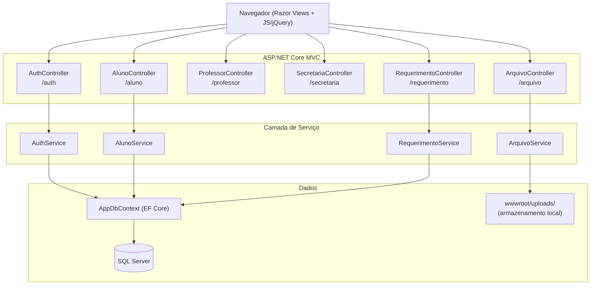
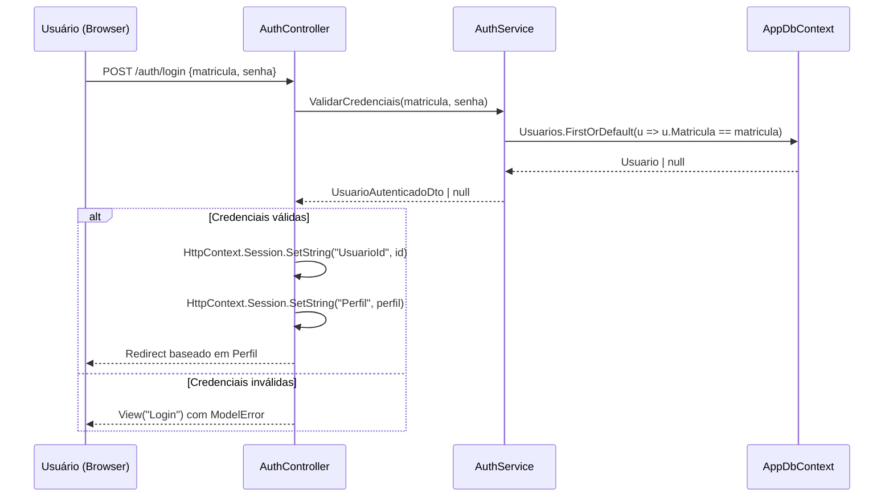
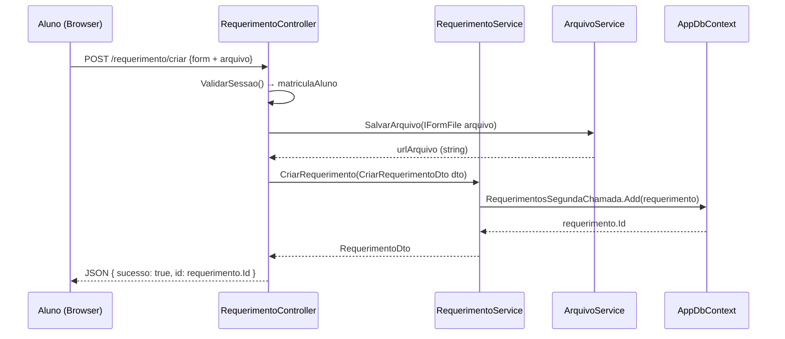

# Documento de Design: Sistema de Segunda Chamada Acadêmica

> **Status:** Rascunho Inicial — aguardando contexto das telas de Professor e Secretaria/Coordenador  
> **Stack:** ASP.NET Core MVC · Entity Framework Core · SQL Server · Bootstrap 5 · jQuery  
> **Abordagem:** Design de Baixo Nível (assinaturas, contratos de API, estrutura de componentes)

---

## 1. Visão Geral

Sistema web para solicitação e gestão de **Segunda Chamada de Provas** em instituição de ensino superior. Alunos submetem requerimentos com atestados digitais; professores e a secretaria/coordenação gerenciam o fluxo de aprovação. A aplicação é construída sobre ASP.NET Core MVC com renderização server-side (Razor Views) e endpoints REST para operações assíncronas via JavaScript/jQuery.

---

## 2. Paleta de Cores e Identidade Visual

A psicologia das cores escolhida transmite **confiança**, **seriedade institucional** e **segurança**.

| Token CSS               | Valor Hex   | Uso                                              |
|-------------------------|-------------|--------------------------------------------------|
| `--color-primary`       | `#1A3A6B`   | Azul institucional escuro — cabeçalhos, botões primários |
| `--color-primary-light` | `#2E5FA3`   | Azul médio — hover de botões, links ativos       |
| `--color-accent`        | `#4A90D9`   | Azul claro — badges, ícones de destaque          |
| `--color-success`       | `#2E7D32`   | Verde escuro — status "Aprovado"                 |
| `--color-danger`        | `#C62828`   | Vermelho escuro — status "Negado", erros         |
| `--color-warning`       | `#F57F17`   | Âmbar — status "Pendente"                        |
| `--color-bg`            | `#F4F6F9`   | Cinza muito claro — fundo geral das páginas      |
| `--color-surface`       | `#FFFFFF`   | Branco — cards, formulários, modais              |
| `--color-text-primary`  | `#1C1C1E`   | Quase preto — texto principal                    |
| `--color-text-secondary`| `#6B7280`   | Cinza médio — labels, textos auxiliares          |
| `--color-border`        | `#D1D5DB`   | Cinza claro — bordas de inputs e cards           |

**Tipografia:** Inter (Google Fonts) — Regular 400 para corpo, SemiBold 600 para títulos de seção, Bold 700 para headings principais.

---

## 3. Arquitetura Geral



### Fluxo de Autenticação e Redirecionamento



### Fluxo de Submissão de Requerimento



---

## 4. Estrutura de Controllers e Assinaturas de Actions

### 4.1 AuthController

```csharp
namespace Hackathon_segunda_chamada.Controllers
{
    [Route("auth")]
    public class AuthController : Controller
    {
        // GET /auth/login
        // Retorna: View de login
        public IActionResult Login();

        // POST /auth/login
        // Body: LoginViewModel { Matricula: int, Senha: string }
        // Retorna: Redirect para dashboard do perfil | View com erro
        [HttpPost("login")]
        [ValidateAntiForgeryToken]
        public async Task<IActionResult> Login(LoginViewModel model);

        // POST /auth/logout
        // Retorna: Redirect para /auth/login
        [HttpPost("logout")]
        public IActionResult Logout();
    }
}
```

### 4.2 AlunoController

```csharp
namespace Hackathon_segunda_chamada.Controllers
{
    [Route("aluno")]
    [AutorizarPerfil(PerfilUsuario.AlunoEng, PerfilUsuario.AlunoSI)]
    public class AlunoController : Controller
    {
        // GET /aluno/dashboard
        // Retorna: View com DashboardAlunoViewModel
        [HttpGet("dashboard")]
        public async Task<IActionResult> Dashboard();

        // GET /aluno/materias
        // Retorna: JSON List<MateriaDto> — matérias do aluno (para popular select)
        [HttpGet("materias")]
        public async Task<IActionResult> ObterMaterias();

        // GET /aluno/requerimentos
        // Retorna: JSON List<RequerimentoResumoDto> — histórico do aluno
        [HttpGet("requerimentos")]
        public async Task<IActionResult> ObterRequerimentos();
    }
}
```

### 4.3 RequerimentoController

```csharp
namespace Hackathon_segunda_chamada.Controllers
{
    [Route("requerimento")]
    [AutorizarPerfil(PerfilUsuario.AlunoEng, PerfilUsuario.AlunoSI)]
    public class RequerimentoController : Controller
    {
        // POST /requerimento/criar
        // Body: multipart/form-data — CriarRequerimentoViewModel
        // Retorna: JSON { sucesso: bool, id: int, mensagem: string }
        [HttpPost("criar")]
        [ValidateAntiForgeryToken]
        public async Task<IActionResult> Criar([FromForm] CriarRequerimentoViewModel model);

        // GET /requerimento/{id}
        // Retorna: JSON RequerimentoDetalheDto
        [HttpGet("{id:int}")]
        public async Task<IActionResult> Detalhe(int id);
    }
}
```

### 4.4 ArquivoController

```csharp
namespace Hackathon_segunda_chamada.Controllers
{
    [Route("arquivo")]
    public class ArquivoController : Controller
    {
        // POST /arquivo/upload
        // Body: multipart/form-data { arquivo: IFormFile }
        // Retorna: JSON { url: string, nomeArquivo: string }
        [HttpPost("upload")]
        public async Task<IActionResult> Upload(IFormFile arquivo);
    }
}
```

> **Nota:** Controllers de Professor e Secretaria serão detalhados após recebimento do contexto adicional.

---

## 5. Camada de Serviço — Assinaturas

### 5.1 AuthService

```csharp
public interface IAuthService
{
    // Valida matrícula + senha; retorna DTO com dados do usuário ou null
    // Precondição: matricula > 0, senha não nula/vazia
    // Pós-condição: retorna null se credenciais inválidas; UsuarioAutenticadoDto se válidas
    Task<UsuarioAutenticadoDto?> ValidarCredenciais(int matricula, string senha);
}
```

### 5.2 AlunoService

```csharp
public interface IAlunoService
{
    // Retorna dados de perfil do aluno (curso, período, turno) derivados do enum Perfil
    // Precondição: matricula existe no banco
    // Pós-condição: nunca retorna null para matrícula válida
    Task<DadosAlunoDto> ObterDadosAluno(int matricula);

    // Retorna lista de matérias em que o aluno está matriculado
    // Precondição: matricula existe no banco
    // Pós-condição: lista pode ser vazia, nunca null
    Task<List<MateriaDto>> ObterMaterias(int matricula);

    // Retorna histórico de requerimentos do aluno
    // Precondição: matricula existe no banco
    // Pós-condição: lista ordenada por DataCriacao DESC
    Task<List<RequerimentoResumoDto>> ObterRequerimentos(int matricula);
}
```

### 5.3 RequerimentoService

```csharp
public interface IRequerimentoService
{
    // Cria novo requerimento com status "Pendente"
    // Precondição: dto.MatriculaAluno válida, dto.NomeMateria não vazio,
    //              dto.TipoAtestado ∈ {"medico","trabalho","obito"}, dto.URLAtestado não vazio
    // Pós-condição: requerimento persistido com DataCriacao = DateTime.UtcNow, Status = "Pendente"
    Task<RequerimentoDto> CriarRequerimento(CriarRequerimentoDto dto);

    // Retorna detalhe de um requerimento
    // Precondição: id > 0
    // Pós-condição: retorna null se não encontrado
    Task<RequerimentoDetalheDto?> ObterPorId(int id);
}
```

### 5.4 ArquivoService

```csharp
public interface IArquivoService
{
    // Valida e persiste arquivo no servidor
    // Precondição: arquivo não nulo, tamanho ≤ 10 MB,
    //              extensão ∈ {".pdf", ".jpg", ".jpeg", ".png"}
    // Pós-condição: arquivo salvo em wwwroot/uploads/{guid}{extensao}
    //               retorna URL relativa acessível publicamente
    Task<string> SalvarArquivo(IFormFile arquivo);
}
```

---

## 6. ViewModels e DTOs

### 6.1 ViewModels (entrada — formulários Razor)

```csharp
// Tela de Login
public class LoginViewModel
{
    [Required] public int Matricula { get; set; }
    [Required] public string Senha { get; set; }
}

// Formulário de Solicitação de Segunda Chamada
public class CriarRequerimentoViewModel
{
    [Required] public string NomeMateria { get; set; }
    [Required] public string Motivo { get; set; }
    [Required] public string TipoAtestado { get; set; }  // "medico" | "trabalho" | "obito"
    [Required] public IFormFile Arquivo { get; set; }
}
```

### 6.2 DTOs (saída — respostas JSON)

```csharp
// Dados do usuário autenticado (armazenado em Session)
public record UsuarioAutenticadoDto(
    int Id,
    int Matricula,
    PerfilUsuario Perfil
);

// Dados de perfil do aluno para o Dashboard
public record DadosAlunoDto(
    int Matricula,
    string NomeCompleto,   // placeholder até modelo ser expandido
    string Curso,          // "Engenharia" | "Sistemas de Informação"
    string Periodo,        // ex: "3º Período"
    string Turno           // "Manhã" | "Tarde" | "Noite"
);

// Item de matéria para o <select> do formulário
public record MateriaDto(
    string Codigo,
    string Nome
);

// Resumo de requerimento para listagem no Dashboard
public record RequerimentoResumoDto(
    int Id,
    string NomeMateria,
    string TipoAtestado,
    string Status,         // "Pendente" | "Aprovado" | "Negado"
    DateTime DataCriacao
);

// Detalhe completo de um requerimento
public record RequerimentoDetalheDto(
    int Id,
    int MatriculaAluno,
    string NomeMateria,
    string Motivo,
    string TipoAtestado,
    string URLAtestado,
    string Status,
    DateTime DataCriacao
);

// Resposta de criação de requerimento
public record CriarRequerimentoResultDto(
    bool Sucesso,
    int? Id,
    string Mensagem
);
```

---

## 7. Contratos de API (Endpoints REST)

Todos os endpoints retornam `application/json`. Erros seguem o formato `{ sucesso: false, mensagem: string }`.

### POST `/auth/login`

```
Request (application/x-www-form-urlencoded):
  matricula: int
  senha: string
  __RequestVerificationToken: string

Response (redirect):
  302 → /aluno/dashboard   (AlunoEng | AlunoSI)
  302 → /professor/...     (Professor)   [a definir]
  302 → /secretaria/...    (Coordenador) [a definir]

Response (erro):
  200 → View com ModelState errors
```

### GET `/aluno/materias`

```
Headers: Cookie de sessão válida (perfil Aluno)

Response 200:
[
  { "codigo": "MAT101", "nome": "Cálculo I" },
  { "codigo": "POO202", "nome": "Programação Orientada a Objetos" }
]

Response 401: { "sucesso": false, "mensagem": "Não autorizado" }
```

### GET `/aluno/requerimentos`

```
Headers: Cookie de sessão válida (perfil Aluno)

Response 200:
[
  {
    "id": 1,
    "nomeMateria": "Cálculo I",
    "tipoAtestado": "medico",
    "status": "Pendente",
    "dataCriacao": "2025-05-24T17:35:00Z"
  }
]
```

### POST `/requerimento/criar`

```
Request (multipart/form-data):
  nomeMateria: string        (obrigatório)
  motivo: string             (obrigatório)
  tipoAtestado: string       (obrigatório — "medico" | "trabalho" | "obito")
  arquivo: File              (obrigatório — PDF | JPG | PNG, máx 10 MB)
  __RequestVerificationToken: string

Response 200:
  { "sucesso": true, "id": 42, "mensagem": "Requerimento criado com sucesso." }

Response 400:
  { "sucesso": false, "id": null, "mensagem": "Arquivo inválido ou campos obrigatórios ausentes." }

Response 401:
  { "sucesso": false, "id": null, "mensagem": "Sessão expirada." }
```

### POST `/arquivo/upload`

```
Request (multipart/form-data):
  arquivo: File

Response 200:
  { "url": "/uploads/3f2a1b-atestado.pdf", "nomeArquivo": "3f2a1b-atestado.pdf" }

Response 400:
  { "sucesso": false, "mensagem": "Tipo de arquivo não permitido." }
```

---

## 8. Estrutura de Views e Componentes Frontend

### 8.1 Hierarquia de Views

```
Views/
├── Shared/
│   ├── _Layout.cshtml              ← layout base com navbar institucional
│   ├── _NavbarAluno.cshtml         ← partial: navbar do aluno
│   ├── _NavbarProfessor.cshtml     ← partial: navbar do professor [a definir]
│   ├── _NavbarSecretaria.cshtml    ← partial: navbar da secretaria [a definir]
│   └── _StatusBadge.cshtml         ← partial: badge colorido de status
│
├── Auth/
│   └── Login.cshtml                ← tela de login
│
├── Aluno/
│   └── Dashboard.cshtml            ← dashboard do aluno + modal de solicitação
│
├── Professor/                      ← [a definir]
│
└── Secretaria/                     ← [a definir]
```

### 8.2 Componentes da Tela de Login (`Auth/Login.cshtml`)

| Componente          | Tipo HTML          | Comportamento                                      |
|---------------------|--------------------|----------------------------------------------------|
| Logo institucional  | ``            | Centralizado no topo do card                       |
| Card de login       | `<div.card>`       | Centralizado na tela, sombra suave, borda arredondada |
| Campo Matrícula     | `<input type="number">` | Validação: obrigatório, inteiro positivo       |
| Campo Senha         | `<input type="password">` | Validação: obrigatório, mínimo 3 chars       |
| Botão Entrar        | `<button type="submit">` | Cor `--color-primary`, full-width             |
| Mensagem de erro    | `<div.alert-danger>` | Exibida via ModelState ou TempData              |

### 8.3 Componentes do Dashboard do Aluno (`Aluno/Dashboard.cshtml`)

| Componente              | Tipo HTML              | Comportamento                                         |
|-------------------------|------------------------|-------------------------------------------------------|
| Card de dados do aluno  | `<div.card>`           | Exibe Matrícula, Curso, Período, Turno                |
| Botão "+" Nova Solicitação | `<button#btn-nova-solicitacao>` | Alinhado à direita; abre modal via JS      |
| Tabela de requerimentos | `<table#tabela-requerimentos>` | Carregada via AJAX em `GET /aluno/requerimentos` |
| Badge de status         | `<span.badge>`         | Cores: Pendente=âmbar, Aprovado=verde, Negado=vermelho |
| Modal de solicitação    | `<div#modal-solicitacao>` | Bootstrap Modal; contém o formulário abaixo        |

### 8.4 Componentes do Formulário de Solicitação (dentro do Modal)

| Componente              | Tipo HTML                    | Comportamento                                          |
|-------------------------|------------------------------|--------------------------------------------------------|
| Select de Matéria       | `<select#select-materia>`    | Populado via AJAX em `GET /aluno/materias` ao abrir modal |
| Campo Motivo            | `<textarea#motivo>`          | Obrigatório, máx 500 chars, contador de caracteres     |
| Radio "Tipo de Atestado"| `<input type="radio">`       | Opções: Óbito, Médico, Trabalho — obrigatório          |
| Upload de Arquivo       | `<input#arquivo type="file">` | Accept: `.pdf,.jpg,.jpeg,.png`; exibe nome do arquivo selecionado |
| Preview do arquivo      | `<div#preview-arquivo>`      | Exibe ícone PDF ou thumbnail de imagem                 |
| Botão Enviar            | `<button#btn-enviar>`        | Dispara `POST /requerimento/criar` via fetch/AJAX      |
| Botão Cancelar          | `<button>`                   | Fecha modal, limpa formulário                          |
| Spinner de loading      | `<div.spinner-border>`       | Exibido durante o envio; botão desabilitado            |
| Alerta de resultado     | `<div#alerta-resultado>`     | Sucesso (verde) ou erro (vermelho) após resposta       |

---

## 9. Lógica JavaScript — Assinaturas de Funções

```javascript
// site.js (ou aluno-dashboard.js)

/**
 * Inicializa o dashboard: carrega requerimentos e configura eventos.
 * Chamado em DOMContentLoaded.
 */
async function inicializarDashboard() { ... }

/**
 * Carrega matérias do aluno via AJAX e popula o <select>.
 * @returns {Promise<void>}
 */
async function carregarMaterias() { ... }

/**
 * Carrega histórico de requerimentos e renderiza na tabela.
 * @returns {Promise<void>}
 */
async function carregarRequerimentos() { ... }

/**
 * Renderiza uma linha da tabela de requerimentos.
 * @param {Object} requerimento - RequerimentoResumoDto
 * @returns {string} HTML da linha <tr>
 */
function renderizarLinhaRequerimento(requerimento) { ... }

/**
 * Retorna classe CSS Bootstrap para o badge de status.
 * @param {string} status - "Pendente" | "Aprovado" | "Negado"
 * @returns {string} - "warning" | "success" | "danger"
 */
function obterClasseStatus(status) { ... }

/**
 * Abre o modal de solicitação e dispara carregarMaterias().
 */
function abrirModalSolicitacao() { ... }

/**
 * Fecha e limpa o modal de solicitação.
 */
function fecharModalSolicitacao() { ... }

/**
 * Valida o formulário de solicitação no lado cliente.
 * @returns {boolean} true se válido
 */
function validarFormulario() { ... }

/**
 * Exibe preview do arquivo selecionado (ícone PDF ou thumbnail).
 * @param {File} arquivo
 */
function exibirPreviewArquivo(arquivo) { ... }

/**
 * Submete o formulário de solicitação via fetch (multipart/form-data).
 * @param {Event} evento
 * @returns {Promise<void>}
 */
async function submeterSolicitacao(evento) { ... }

/**
 * Exibe mensagem de resultado no modal (sucesso ou erro).
 * @param {boolean} sucesso
 * @param {string} mensagem
 */
function exibirResultado(sucesso, mensagem) { ... }
```

---

## 10. Filtro de Autorização por Perfil

```csharp
// Attribute customizado para proteger controllers/actions por perfil
[AttributeUsage(AttributeTargets.Class | AttributeTargets.Method)]
public class AutorizarPerfilAttribute : ActionFilterAttribute
{
    private readonly PerfilUsuario[] _perfisPermitidos;

    public AutorizarPerfilAttribute(params PerfilUsuario[] perfis);

    // Precondição: HttpContext.Session contém "Perfil"
    // Pós-condição: redireciona para /auth/login se sessão inválida ou perfil não autorizado
    public override void OnActionExecuting(ActionExecutingContext context);
}
```

---

## 11. Estrutura de Pastas Proposta

```
Hackathon segunda chamada/
├── Controllers/
│   ├── HomeController.cs          ← existente
│   ├── AuthController.cs          ← novo
│   ├── AlunoController.cs         ← novo
│   ├── RequerimentoController.cs  ← novo
│   ├── ArquivoController.cs       ← novo
│   ├── ProfessorController.cs     ← a definir
│   └── SecretariaController.cs    ← a definir
│
├── Services/
│   ├── IAuthService.cs / AuthService.cs
│   ├── IAlunoService.cs / AlunoService.cs
│   ├── IRequerimentoService.cs / RequerimentoService.cs
│   └── IArquivoService.cs / ArquivoService.cs
│
├── Models/
│   ├── Usuario.cs                 ← existente
│   ├── RequerimentoSegundaChamada.cs ← existente
│   └── ViewModels/
│       ├── LoginViewModel.cs
│       └── CriarRequerimentoViewModel.cs
│
├── DTOs/
│   ├── UsuarioAutenticadoDto.cs
│   ├── DadosAlunoDto.cs
│   ├── MateriaDto.cs
│   ├── RequerimentoResumoDto.cs
│   ├── RequerimentoDetalheDto.cs
│   └── CriarRequerimentoResultDto.cs
│
├── Filters/
│   └── AutorizarPerfilAttribute.cs
│
├── Data/
│   └── AppDbContext.cs            ← existente
│
├── Views/
│   ├── Auth/Login.cshtml
│   ├── Aluno/Dashboard.cshtml
│   ├── Professor/...              ← a definir
│   ├── Secretaria/...             ← a definir
│   └── Shared/
│       ├── _Layout.cshtml
│       ├── _NavbarAluno.cshtml
│       └── _StatusBadge.cshtml
│
└── wwwroot/
    ├── css/site.css
    ├── js/
    │   ├── site.js
    │   └── aluno-dashboard.js
    └── uploads/                   ← criado em runtime (gitignored)
```

---

## 12. Considerações de Segurança

| Risco                  | Mitigação                                                                 |
|------------------------|---------------------------------------------------------------------------|
| SQL Injection          | EF Core com LINQ parametrizado — sem SQL raw                              |
| CSRF                   | `[ValidateAntiForgeryToken]` em todos os POSTs                            |
| Upload malicioso       | Validação de extensão + MIME type + tamanho máximo (10 MB) no `ArquivoService` |
| Acesso não autorizado  | `AutorizarPerfilAttribute` em todos os controllers protegidos             |
| Senhas em texto claro  | **Pendente:** implementar BCrypt/PBKDF2 — seed atual usa texto claro (apenas dev) |
| Path traversal         | Nome do arquivo gerado com `Guid.NewGuid()` — nunca usa nome original     |

---

## 13. Itens Pendentes (aguardando contexto)

- [ ] Tela e lógica do **Professor**: quais ações ele realiza? Visualiza requerimentos? Aprova/nega?
- [ ] Tela e lógica da **Secretaria/Coordenador**: fluxo de aprovação, filtros, relatórios?
- [ ] Modelo de **Matérias**: as matérias são fixas por curso ou vêm de uma tabela no banco?
- [ ] Modelo de **Dados do Aluno**: Período e Turno são derivados do enum `Perfil` ou precisam de nova tabela?
- [ ] Estratégia de **hash de senha** para produção
- [ ] Necessidade de **notificações** (e-mail, push) ao aluno sobre mudança de status


---

## 14. Propriedades de Corretude

*Uma propriedade é uma característica ou comportamento que deve ser verdadeiro em todas as execuções válidas do sistema — essencialmente, uma declaração formal sobre o que o sistema deve fazer. As propriedades servem como ponte entre especificações legíveis por humanos e garantias de corretude verificáveis por máquina.*

### Propriedade 1: Autenticação redireciona para o dashboard correto por perfil

*Para qualquer* usuário válido cadastrado no banco com um perfil definido, ao realizar login com credenciais corretas, o sistema deve redirecionar para o dashboard correspondente ao perfil do usuário.

**Valida: Requisitos 1.1, 1.2, 1.3**

---

### Propriedade 2: Credenciais inválidas nunca resultam em autenticação

*Para qualquer* combinação de matrícula e senha que não corresponda a um usuário cadastrado no banco, o `AuthService` deve retornar `null` e o sistema nunca deve criar uma sessão autenticada.

**Valida: Requisitos 1.4, 1.6**

---

### Propriedade 3: Requerimento criado sempre inicia com status Pendente

*Para qualquer* requerimento criado com dados válidos (matéria não vazia, tipo de atestado válido, URL de atestado não vazia), o `RequerimentoService` deve persistir o requerimento com `Status = "Pendente"` e `DataCriacao` preenchida.

**Valida: Requisitos 3.3, 3.4**

---

### Propriedade 4: Round-trip de requerimento preserva todos os dados

*Para qualquer* requerimento criado com dados válidos, buscar o requerimento pelo ID retornado deve produzir um `RequerimentoDetalheDto` com os mesmos valores de todos os campos originais.

**Valida: Requisitos 3.3, 6.1, 6.4**

---

### Propriedade 5: Tipo de atestado inválido sempre é rejeitado

*Para qualquer* valor de `TipoAtestado` que não pertença ao conjunto `{"medico", "trabalho", "obito"}`, o `RequerimentoService` deve rejeitar a criação do requerimento.

**Valida: Requisito 3.6**

---

### Propriedade 6: Upload com extensão inválida sempre é rejeitado

*Para qualquer* arquivo com extensão fora do conjunto `{".pdf", ".jpg", ".jpeg", ".png"}`, o `ArquivoService` deve rejeitar o upload e retornar erro.

**Valida: Requisitos 4.3, 4.6**

---

### Propriedade 7: Nome do arquivo salvo nunca contém o nome original

*Para qualquer* arquivo enviado com qualquer nome original, o `ArquivoService` deve salvar o arquivo com um nome gerado por `Guid.NewGuid()`, de forma que o nome salvo nunca seja igual ao nome original do arquivo.

**Valida: Requisitos 4.2, 8.4**

---

### Propriedade 8: Acesso sem sessão válida sempre redireciona para login

*Para qualquer* endpoint protegido pelo `AutorizarPerfilAttribute`, uma requisição sem Session válida deve sempre resultar em redirecionamento para `/auth/login`, independentemente do endpoint acessado.

**Valida: Requisitos 5.1, 5.2, 5.5**

---

### Propriedade 9: Badge de status sempre exibe a classe CSS correta

*Para qualquer* valor de status válido (`"Pendente"`, `"Aprovado"`, `"Negado"`), a função `obterClasseStatus` deve retornar respectivamente `"warning"`, `"success"` e `"danger"`.

**Valida: Requisitos 2.5, 2.6, 2.7**

---

### Propriedade 10: Histórico de requerimentos sempre ordenado por data decrescente

*Para qualquer* lista de requerimentos de um aluno, o `AlunoService` deve retornar os requerimentos ordenados por `DataCriacao` em ordem decrescente, de forma que o requerimento mais recente sempre apareça primeiro.

**Valida: Requisito 2.3**

---

### Propriedade 11: Validação de formulário rejeita qualquer campo obrigatório ausente

*Para qualquer* combinação de campos obrigatórios ausentes no formulário de solicitação (matéria, motivo, tipo de atestado ou arquivo), a função `validarFormulario` deve retornar `false` e impedir o envio.

**Valida: Requisitos 7.1, 7.2, 7.3, 7.4**
